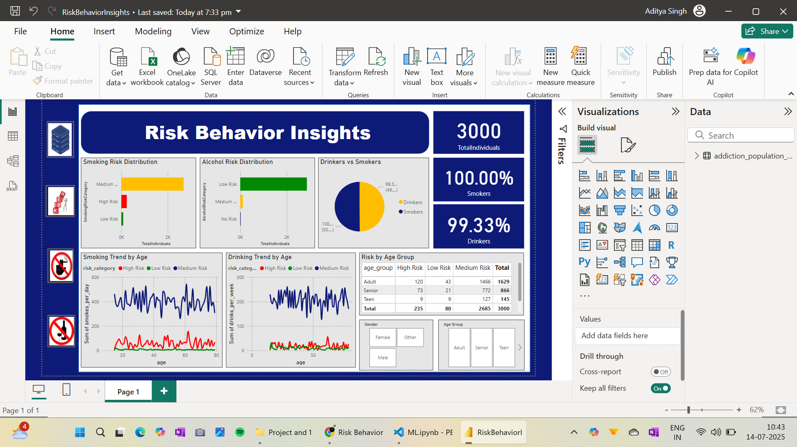

# 🧠 Risk Behavior Prediction Based on Demographic and Lifestyle Features

This project uses data science and machine learning to predict risky behaviors like smoking and excessive drinking, based on demographic and lifestyle attributes. A Power BI dashboard was also built to explore clusters and provide insights for targeted health interventions.

---

## 📌 Project Overview

### 📝 Problem Statement:
Create a behavioral prediction model by examining demographic profiles, lifestyle choices, and health indicators to assess the likelihood of engaging in risky behaviors like:
- 🚬 Smoking
- 🍺 Excessive alcohol consumption
- 🚗 Risk-prone behavior (e.g., reckless driving - conceptual)

### 🎯 Goal:
- Build classification models to flag high-risk individuals.
- Use Power BI for visual analysis and cluster exploration.
- Identify key factors contributing to health risks.

---

## 🧪 Technologies Used

| Category          | Tools / Libraries                        |
|------------------|-------------------------------------------|
| Language         | Python (Jupyter Notebook)                 |
| Data Handling    | `pandas`, `numpy`                         |
| Visualization    | `matplotlib`, `seaborn`                   |
| ML Models        | `sklearn` (Logistic Regression, Decision Tree) |
| Dashboarding     | Microsoft Power BI                        |
| Deployment       | GitHub                                    |

---

## 📊 Exploratory Data Analysis

Performed deep analysis on:
- Age, Gender, Income distribution
- Lifestyle habits: Smoking, Drinking, Exercise
- Health indicators: BMI, Sleep, Mental health
- Correlation matrix and boxplots for outliers

---

## 🤖 Machine Learning Workflow

### Features Considered:
- Age, Gender, Education, Employment
- Smoking/Drinking frequency, BMI, Sleep Hours
- Mental health, Diet quality, Exercise frequency

### Target Variable:
- Created `risk_category` with 3 levels: `High Risk`, `Medium Risk`, `Low Risk`  
  *(based on thresholds of smoking and drinking frequency)*

### Models Applied:
- Logistic Regression
- Decision Tree
- Random Forest (optional)

### Evaluation Metrics:
- Accuracy, Precision, Recall
- Confusion Matrix

---

## 📈 Power BI Dashboard

Created a rich, interactive dashboard that includes:
- **Smoking & Alcohol Risk Distribution**
- **Trend Analysis by Age**
- **Demographic Split by Gender and Age Groups**
- **Pie Charts for Smoker vs Drinker Ratio**
- **Key Metrics (Total Individuals, % Smokers, % Drinkers)**

  

---

## 📥 Dataset

- [`addiction_population_data.csv`](https://www.kaggle.com/datasets/khushikyad001/cigarettes-and-alcohol-addiction?resource=download)  
  A synthetic population dataset with 3,000 records and 25 features related to demographics, habits, and health.

---
